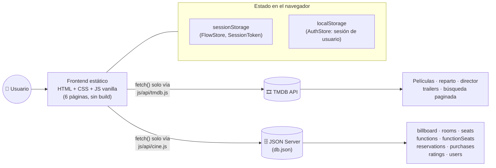
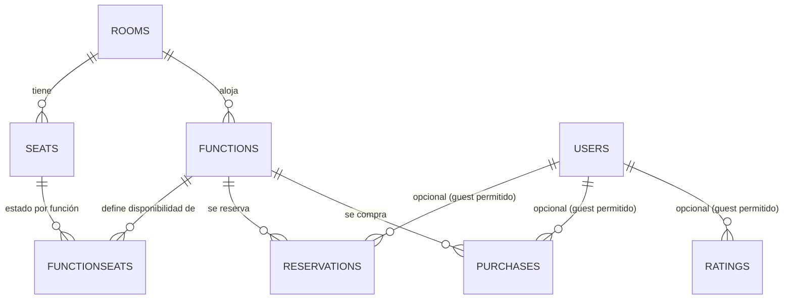
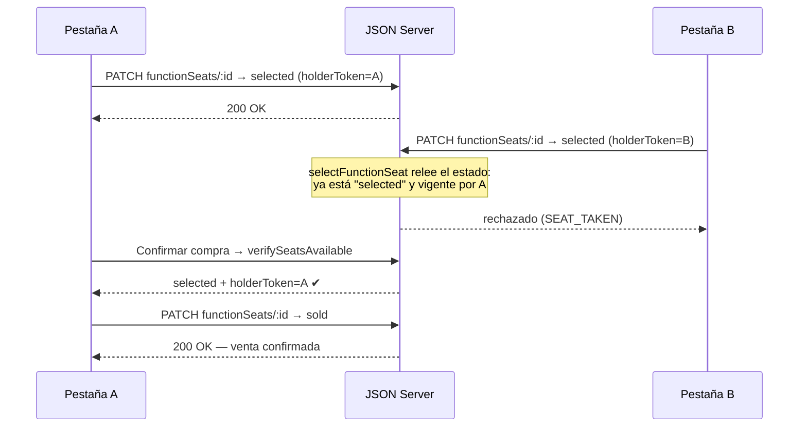
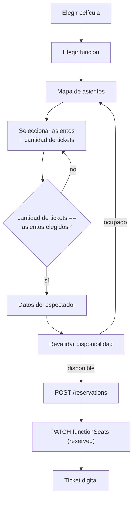
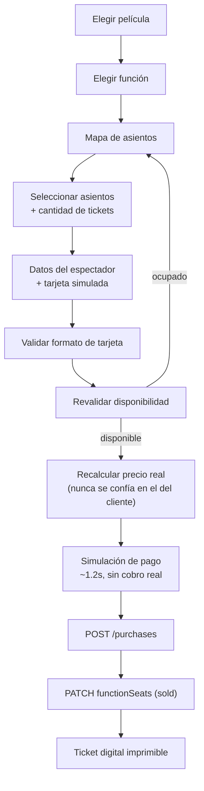

<div align="center">

# 🎬 CINEVERSE

### Sistema web de gestión de cartelera y venta de entradas de cine

Plataforma de cine premium construida en **JavaScript vanilla puro**: cartelera real,
ficha de película con datos de [TMDB](https://www.themoviedb.org/), mapa de asientos
interactivo, reservas y compras con **prevención real de doble venta**, pasarela de
pago simulada con tarjeta 3D, valoraciones, autenticación y un historial de tickets
imprimibles — todo persistido contra un backend simulado con **JSON Server**.

[](#)
[](#)
[](#)
[](https://www.themoviedb.org/documentation/api)
[](https://github.com/typicode/json-server)
[](https://gsap.com/)

[](https://github.com/santiagosanabria-1/proyecto-javascrip-santiago/tags)
[](#-25-licencia)
[](#)

</div>

---

## 📌 Tabla de contenidos

1. [Descripción del proyecto](#-1-descripción-del-proyecto)
2. [Características principales](#-2-características-principales)
3. [Tecnologías utilizadas](#-3-tecnologías-utilizadas)
4. [Arquitectura](#-4-arquitectura)
5. [Estructura del proyecto](#-5-estructura-del-proyecto)
6. [Modelo de datos](#-6-modelo-de-datos)
7. [Sistema de asientos](#-7-sistema-de-asientos)
8. [Anti-doble-venta](#-8-anti-doble-venta)
9. [Flujos principales](#-9-flujos-principales)
10. [Valoraciones](#-10-valoraciones)
11. [Autenticación](#-11-autenticación)
12. [Mis tickets](#-12-mis-tickets)
13. [Integración con TMDB](#-13-integración-con-tmdb)
14. [JSON Server](#-14-json-server)
15. [Responsive](#-15-responsive)
16. [Animaciones y UX](#-16-animaciones-y-ux)
17. [Manejo de errores](#-17-manejo-de-errores)
18. [Decisiones técnicas](#-18-decisiones-técnicas)
19. [Instalación y ejecución](#-19-instalación-y-ejecución)
20. [Pruebas realizadas](#-20-pruebas-realizadas)
21. [Requisitos funcionales](#-21-requisitos-funcionales)
22. [Capturas de pantalla](#-22-capturas-de-pantalla)
23. [Roadmap](#-23-roadmap)
24. [Autor](#-24-autor)
25. [Licencia](#-25-licencia)

---

## 🎬 1. Descripción del proyecto

**CINEVERSE** es un sistema web que simula la operación de un cine real: muestra su
cartelera vigente, permite consultar el detalle de cada película (sinopsis, reparto,
director, trailer, valoraciones), elegir una función, seleccionar asientos en un mapa
visual de la sala, y completar una reserva o una compra con una pasarela de pago
simulada — terminando en un ticket digital imprimible.

El objetivo del proyecto es demostrar, con **JavaScript vanilla** (sin frameworks ni
build step), cómo resolver correctamente los problemas que sí importan en un sistema
de venta de entradas real:

- ¿Cómo se relaciona un asiento físico con su disponibilidad **por función**, y no de
  forma global?
- ¿Cómo se evita que dos personas terminen "comprando" el mismo asiento?
- ¿Cómo se persiste de verdad una reserva/compra en vez de simularla solo en el DOM?
- ¿Cómo se combina una API pública de terceros (TMDB) con datos propios del negocio
  (funciones, salas, precios) sin mezclar sus responsabilidades?

Es un proyecto de alcance académico, pensado para practicar arquitectura de frontend,
consumo de APIs REST, modelado de datos relacional (aunque el "backend" sea un archivo
JSON) y control de concurrencia — no un sistema listo para producción real (ver
[Autenticación](#-11-autenticación) y [Decisiones técnicas](#-18-decisiones-técnicas)
para las limitaciones asumidas a propósito).

---

## ⭐ 2. Características principales

```text
✅ Cartelera curada del cine (27 películas reales vía TMDB, no todo el catálogo)
✅ Búsqueda paginada sobre el catálogo COMPLETO de TMDB, con cancelación de requests
✅ Filtro por género (Acción · Sci-Fi · Drama · Comedia · Terror)
✅ Ficha de película: sinopsis, géneros, rating, duración, fecha de estreno, reparto,
   director y trailer embebido de YouTube
✅ Funciones reales por película (fecha, hora, sala, precio) — nunca fechas pasadas
✅ Mapa de asientos dinámico por sala, con 5 estados posibles
✅ Selector de cantidad de tickets con validación estricta (tickets == asientos)
✅ Selección múltiple de asientos persistida en tiempo real contra JSON Server
✅ Anti-doble-venta real: token de sesión + expiración + revalidación final
✅ Reserva sin pago, o compra con pasarela simulada (tarjeta 3D, flip real en el CVV)
✅ Ticket digital imprimible/descargable con toda la información de la compra
✅ Login y registro con contraseña hasheada (SHA-256, Web Crypto nativo)
✅ Historial "Mis tickets" filtrado por usuario, con modal "Ver ticket"
✅ Valoraciones por película (nombre, estrellas, comentario) con protección XSS
✅ Animaciones GSAP + ScrollTrigger, con soporte para prefers-reduced-motion
✅ Responsive verificado en 5 resoluciones distintas (375px → 1920px)
```

> No incluye (a propósito, ver [Roadmap](#-23-roadmap)): backend/base de datos real,
> pasarela de pago real, panel administrativo, tests automatizados ni despliegue.

---

## 🧰 3. Tecnologías utilizadas

| Tecnología | Versión / origen | Uso en el proyecto |
|---|---|---|
| **HTML5** | — | Estructura semántica de las 6 páginas (`index`, `pelicula`, `funcion`, `reserva`, `login`, `mis-tickets`) |
| **CSS3** | — | Sistema de diseño con custom properties, Grid/Flexbox, `@media print` para el ticket, `prefers-reduced-motion` |
| **JavaScript (vanilla, ES6+)** | — | Toda la lógica de cliente: sin framework, sin bundler, sin transpilación |
| **[TMDB API](https://www.themoviedb.org/documentation/api)** | v3 REST (acepta API Key v3 o Read Access Token v4) | Catálogo de películas, detalle, reparto, director, trailers, búsqueda |
| **[JSON Server](https://github.com/typicode/json-server)** | `^1.0.0-beta.15` (`package.json`) | Backend REST simulado: salas, funciones, asientos, reservas, compras, valoraciones, usuarios |
| **[GSAP](https://gsap.com/) + ScrollTrigger** | `3.12.5` (vía CDN — no está en `package.json`) | Animaciones de scroll, reveals, tilt 3D del póster, flip 3D de la tarjeta de pago |
| **Web Crypto API** (`crypto.subtle`) | Nativa del navegador | `SHA-256` para hashear contraseñas antes de guardarlas |
| **Node.js / npm** | — | Solo para correr `json-server` y el script de seed — no hay proceso de build |

No se usa ningún framework de frontend (React, Vue, Angular), ni CSS preprocesado, ni
TypeScript: es una decisión explícita del proyecto, no una limitación técnica.

---

## 🏗️ 4. Arquitectura

CINEVERSE es un **frontend 100% estático** que habla con dos fuentes de datos
externas, cada una detrás de un único módulo "puerta de entrada" — ningún otro
archivo hace `fetch()` directo a TMDB o a JSON Server:



**Por qué esta separación:** TMDB es la única fuente de verdad para "qué es una
película" (nunca se copian sus datos a `db.json`); JSON Server es la única fuente de
verdad para "qué vende este cine" (funciones, precios, salas, disponibilidad). Las
funciones (`functions`) solo guardan el `tmdbId` como referencia — la información de
la película se pide a TMDB en el momento, siempre fresca.

Cada página HTML es independiente (no hay SPA ni router): la navegación entre
`index.html → pelicula.html → funcion.html → reserva.html` se hace con enlaces reales
y una query string (`?id=`, `?functionId=`), y el "carrito" de la compra en curso
viaja entre esas páginas vía `sessionStorage` (`FlowStore`, en `js/store.js`).

---

## 📂 5. Estructura del proyecto

```text
cineplex-v2/
├── index.html            # Cartelera + hero + galería
├── pelicula.html         # Ficha de película (reparto, funciones, valoraciones)
├── funcion.html          # Mapa de asientos + selección
├── reserva.html          # Datos del espectador + pago + ticket
├── login.html            # Iniciar sesión / crear cuenta
├── mis-tickets.html      # Historial de compras y reservas del usuario
│
├── css/
│   ├── styles.css        # Sistema de diseño (tokens, componentes, estados)
│   └── animations.css    # Estados iniciales de reveal + prefers-reduced-motion
│
├── js/
│   ├── config.js         # CONFIG: API key de TMDB, URLs base
│   ├── store.js          # FlowStore (carrito), AuthStore (sesión), SessionToken
│   ├── ui-helpers.js     # Estados de UI, formato, navbar/auth, toasts, escapeHtml
│   ├── cartelera.js      # Lógica de index.html
│   ├── pelicula.js       # Lógica de pelicula.html
│   ├── funcion.js        # Lógica de funcion.html (mapa de asientos)
│   ├── reserva.js        # Lógica de reserva.html (pago + confirmación)
│   ├── login.js          # Lógica de login.html
│   ├── mis-tickets.js    # Lógica de mis-tickets.html
│   ├── animations/       # Módulos GSAP por página
│   │   ├── global.js     # Namespace Animations + utilidades compartidas
│   │   ├── home.js       # Hero pineado + galería 3D (index.html)
│   │   ├── movie.js      # Tilt del póster + parallax (pelicula.html)
│   │   └── seats.js      # Reveal 3D del mapa de asientos (funcion.html)
│   └── api/
│       ├── tmdb.js       # Única puerta de entrada a TMDB
│       └── cine.js       # Única puerta de entrada a JSON Server
│
├── scripts/
│   └── seed.js           # Genera db.json de forma determinística
│
├── db.json                # Generado por seed.js — NO se versiona (.gitignore)
├── serve.json              # Config de `serve` (desactiva "clean URLs")
├── package.json             # Scripts npm + dependencia de json-server
└── .vscode/settings.json    # Evita que Live Server recargue al escribir db.json
```

**Convención clave:** cada página HTML carga exactamente los scripts que necesita, en
un orden fijo (`config.js` → `api/*.js` → `store.js` → `animations/*.js` →
`ui-helpers.js` → el controlador de la página) — no hay un bundle único ni imports
ES modules; todo vive en el scope global (`CONFIG`, `TMDB`, `CINE`, `FlowStore`,
`AuthStore`, `Animations`, `escapeHtml`, etc.).

---

## 🧬 6. Modelo de datos

`db.json` (JSON Server) tiene 9 colecciones. Las funciones (`functions`) referencian
películas de TMDB por `tmdbId`, pero **la película en sí nunca se guarda ahí** — solo
el id.

| Colección | Descripción | Se relaciona con |
|---|---|---|
| `billboard` | Lista curada de `tmdbId` que forman "la cartelera" del cine | TMDB (`tmdbId`, externo) |
| `rooms` | Salas físicas del cine (nombre, filas, asientos por fila, tipo) | — |
| `seats` | Asientos físicos de una sala (fila, número, código, ubicación, tipo) | `rooms.id` |
| `functions` | Una proyección concreta: película + sala + fecha + hora + precio | `rooms.id`, TMDB (`tmdbId`) |
| `functionSeats` | **El corazón del sistema**: estado de un asiento *para una función concreta* | `functions.id`, `seats.id` |
| `reservations` | Reservas confirmadas sin pago | `functions.id`, `rooms.id`, `users.id` (opcional) |
| `purchases` | Compras confirmadas con pago simulado | `functions.id`, `rooms.id`, `users.id` (opcional) |
| `ratings` | Valoraciones de una película | TMDB (`tmdbId`), `users.id` (opcional) |
| `users` | Cuentas registradas (login/registro) | — |



<details>
<summary>📄 Ejemplo real de cada colección (haz clic para expandir)</summary>

```json
// billboard
{ "id": "1", "tmdbId": 157336 }

// rooms
{ "id": "2", "name": "Sala 2 IMAX", "rows": 8, "seatsPerRow": 10, "capacity": 80, "type": "IMAX" }

// seats
{ "id": "1", "roomId": 1, "row": "A", "number": 1, "seatCode": "A1", "location": "Izquierda", "type": "standard" }

// functions
{ "id": "1", "tmdbId": 157336, "roomId": 1, "date": "2026-08-29", "time": "14:30", "price": 6500 }

// functionSeats (disponible)
{ "id": "1", "functionId": 1, "seatId": 1, "status": "available" }

// functionSeats (siendo elegido ahora mismo por alguien)
{ "id": "21", "functionId": 1, "seatId": 21, "status": "selected", "holderToken": "tok_...", "selectedAt": "2026-08-30T00:15:49.524Z" }

// reservations
{
  "id": "6EUMx2XRahg", "status": "confirmed", "createdAt": "2026-08-30T00:37:32.890Z",
  "userId": null, "userName": "Ana Pérez", "email": "ana@mail.com",
  "tmdbId": 155, "functionId": "20", "roomId": 2, "quantity": 2,
  "seats": [{ "seatId": 119, "seatCode": "H1", "location": "Izquierda" }, { "seatId": 120, "seatCode": "H2", "location": "Izquierda" }]
}

// purchases (además de lo anterior)
{ "unitPrice": 6500, "total": 13000, "paymentMethod": { "brand": "VISA", "last4": "1111" } }

// ratings
{ "id": "29USeCEubLQ", "createdAt": "2026-08-29T23:43:37Z", "tmdbId": 157336, "userId": null, "userName": "Santiago", "rating": 5, "comment": "Excelente." }

// users
{ "id": "A36srJkqR9w", "createdAt": "2026-08-30T00:31:04Z", "name": "Ana Pérez", "email": "ana@mail.com", "passwordHash": "5ac0852e..." }
```

</details>

---

## 💺 7. Sistema de asientos

Esta es la pieza más importante del proyecto: **un asiento físico no tiene un único
estado global** — su disponibilidad depende de *para qué función* se está
consultando.

```text
Sala 2, asiento C5
│
├── Función de las 18:30  →  sold        (ya se vendió para esa función)
└── Función de las 21:00  →  available   (para la función de las 21:00, sigue libre)
```

Esto se modela con la colección `functionSeats`: cada fila combina un `seatId` con un
`functionId` y guarda el estado **de esa combinación**, no del asiento en sí. La
"unidad de disponibilidad" real del sistema es siempre `functionId + seatId`, nunca
`seatId` solo — así lo confirma `CINE.getSeatMap(functionId, roomId)` en
`js/api/cine.js`, que cruza `seats` (físicos) con `functionSeats` (estado) function
por función.

### Estados posibles

| Estado | Significado | Interactivo |
|---|---|---|
| `available` | Libre para esta función | ✅ Seleccionable |
| `selected` (mío) | Lo elegí yo en esta pestaña, todavía sin confirmar | ✅ Deseleccionable |
| `selected` (de otro) → `seat--held` | Otra sesión lo tiene elegido *ahora mismo* | ❌ Bloqueado, se ve distinto a "disponible" |
| `reserved` | Reservado (sin pago) de forma definitiva | ❌ Bloqueado |
| `sold` | Comprado de forma definitiva | ❌ Bloqueado |

### Cómo funciona la selección

1. Click en un asiento libre → `funcion.js` llama a `CINE.selectFunctionSeat(id, holderToken)`,
   que hace un `PATCH /functionSeats/:id` a `status: "selected"` — la selección se
   persiste **de inmediato** en JSON Server, no es solo un cambio visual.
2. Click en un asiento ya elegido por mí → se libera con
   `CINE.releaseFunctionSeat(id)` (vuelve a `available`).
3. El resumen en vivo muestra, por cada asiento: **fila**, **número**, **código de
   asiento** (`seatCode`, ej. `C5`) y **ubicación** (`Izquierda`/`Centro`/`Derecha`,
   calculada por columna al generar la sala).
4. Un selector de cantidad de tickets (`+`/`−`) exige que la cantidad elegida
   coincida **exactamente** con los asientos seleccionados antes de habilitar
   "Continuar" — la validación se repite también dentro de la función que navega
   (no depende solo de que el botón esté deshabilitado).
5. Al salir de la página sin confirmar (botón "Volver", cerrar la pestaña, navegar
   afuera), un listener de `beforeunload` libera todos los asientos que esa pestaña
   tenía tomados, para no bloquearlos indefinidamente.

---

## 🔐 8. Anti-doble-venta

El requisito más delicado del proyecto: **dos personas nunca deben poder terminar
comprando el mismo asiento**, ni siquiera si lo eligen casi al mismo tiempo.

**Mecanismo real (`js/api/cine.js`, `js/store.js`):**

- **`holderToken`** — cada pestaña genera un identificador propio (`SessionToken`,
  guardado en `sessionStorage`) la primera vez que lo necesita. No identifica al
  usuario logueado, identifica *esa pestaña/sesión de navegación*.
- **Selección con verificación previa** — `selectFunctionSeat` relee el estado actual
  del asiento antes de escribir: si ya está `selected` por otro `holderToken` vigente
  (o `reserved`/`sold`), rechaza la escritura con un error `SEAT_TAKEN` en vez de
  sobreescribir en silencio.
- **TTL de 10 minutos** (`SELECTION_HOLD_MINUTES`) — una selección abandonada (tab
  cerrada de golpe, red caída, sin que el `beforeunload` llegue a ejecutarse) se
  trata como disponible de nuevo automáticamente pasado ese tiempo, y se libera en
  segundo plano la próxima vez que alguien pide el mapa de asientos.
- **Revalidación final** — justo antes de confirmar una reserva/compra,
  `verifySeatsAvailable(functionId, ids, holderToken)` vuelve a consultar JSON Server
  y solo aprueba si **todos** los asientos siguen `selected` **y** con el mismo
  `holderToken` que los seleccionó. Nunca se confía en lo que el frontend recuerda en
  memoria.



**Límite honesto:** JSON Server no ofrece *compare-and-swap* atómico a nivel de base
de datos, así que la ventana de milisegundos entre "leer" y "escribir" no se puede
cerrar al 100 % solo con este backend. Lo que sí es una garantía real, y está
verificado con pruebas manuales de dos pestañas concurrentes, es que **la venta final
nunca se duplica**: la revalidación justo antes de confirmar es la barrera que de
verdad importa, y esa sí es imposible de saltar desde el cliente.

---

## 🔄 9. Flujos principales

### Reserva (sin pago)



### Compra (con pago simulado)



---

## ⭐ 10. Valoraciones

Cualquier visitante (con o sin sesión) puede dejar una valoración desde la ficha de
la película (`pelicula.html`):

- **Nombre** — si hay sesión activa, se autocompleta con el nombre de la cuenta y
  queda bloqueado; sin sesión, es un campo de texto libre y obligatorio.
- **Puntuación** — de 1 a 5 estrellas (`<select>`).
- **Comentario** — libre, opcional.

Se guarda en JSON Server (`POST /ratings`) con `tmdbId`, `userId` (o `null` si no hay
sesión), `userName`, `rating`, `comment` y `createdAt`. La lista se pide con
`GET /ratings?tmdbId=...` y se muestra ordenada de más reciente a más antigua.

```json
{
  "tmdbId": 157336,
  "userId": null,
  "userName": "Santiago",
  "rating": 5,
  "comment": "Una obra maestra de ciencia ficción.",
  "createdAt": "2026-08-29T23:43:37.871Z"
}
```

**Dos detalles técnicos no triviales, resueltos durante el desarrollo:**

- `tmdbId` se guarda siempre como **número**, nunca como string — JSON Server filtra
  `?tmdbId=...` comparando tipos, así que un valor guardado como texto (por ejemplo,
  tomado tal cual de una query string de la URL) nunca hace match contra el filtro y
  la valoración quedaría invisible para siempre, aunque sí se hubiera guardado.
- El nombre y el comentario pasan por `escapeHtml()` (`js/ui-helpers.js`) antes de
  insertarse en la página — sin este escape, un comentario con HTML/JavaScript se
  ejecutaría para cualquiera que abriera esa película (XSS persistente).

---

## 👤 11. Autenticación

Registro e inicio de sesión reales contra JSON Server (colección `users`):

- La contraseña **nunca** se guarda ni se transmite en texto plano: se hashea con
  `SHA-256` usando `crypto.subtle.digest` (Web Crypto, nativo del navegador — no hay
  ninguna librería de criptografía externa) antes de tocar la red.
- El login compara el hash calculado contra `user.passwordHash` guardado.
- La sesión activa se guarda en `localStorage` (`AuthStore`, en `js/store.js`) como
  `{ id, name, email }` — **nunca** el hash de la contraseña.
- Tener sesión es opcional para reservar o comprar (el flujo de invitado sigue
  funcionando igual), pero es necesario para ver el historial en "Mis tickets".

> ⚠️ **Nivel de seguridad real, sin exagerar:** este es un esquema de autenticación de
> nivel demo. No hay *salt* por usuario, no hay servidor de sesiones ni tokens
> firmados, y cualquiera con acceso a `db.json` puede ver todos los hashes. Es
> suficiente para el alcance de este proyecto académico, **no** para un sistema en
> producción con usuarios reales.

---

## 🎫 12. Mis tickets

`mis-tickets.html` pide en paralelo `GET /reservations?userId=...` y
`GET /purchases?userId=...` para el usuario logueado (`AuthStore.get().id`), los
combina y ordena por fecha. Cada fila se "hidrata" una sola vez con la película
(TMDB), la sala y la función correspondientes, y ofrece un botón **"Ver ticket"** que
abre un modal con el mismo componente visual `.ticket` que se usa al confirmar una
compra — reutilizando el mismo `window.print()` + hoja `@media print` para
descargar/imprimir.

El filtrado es siempre por `userId`: una compra hecha sin sesión (`userId: null`)
nunca aparece en el historial de nadie, y el historial de un usuario nunca mezcla
compras de otro (verificado registrando dos cuentas distintas y comprando con cada
una — ver [Pruebas realizadas](#-20-pruebas-realizadas)).

---

## 🔌 13. Integración con TMDB

Toda la comunicación con TMDB pasa por `js/api/tmdb.js` — es el único archivo que
hace `fetch()` hacia `api.themoviedb.org`.

| Función | Endpoint TMDB real | Uso |
|---|---|---|
| `searchMovies(query, page, signal)` | `GET /search/movie` | Búsqueda paginada sobre todo el catálogo de TMDB, con `AbortSignal` para cancelar una búsqueda en vuelo si el usuario sigue escribiendo |
| `getMovieDetails(id)` | `GET /movie/{id}` | Ficha completa (sinopsis, géneros, duración, fecha de estreno, rating) — con caché en memoria por sesión |
| `getMovieCredits(id)` | `GET /movie/{id}/credits` | Reparto y equipo (para reparto y director) — con caché |
| `getMovieVideos(id)` | `GET /movie/{id}/videos` | Videos, filtrados a trailers oficiales de YouTube |
| `getMoviesByIds(ids)` | *(combina `getMovieDetails` en paralelo)* | Hidrata el `billboard` propio del cine con datos reales |

**Autenticación:** `CONFIG.TMDB_API_KEY` acepta tanto una **API Key v3** (32
caracteres) como un **Read Access Token v4** (JWT) — `js/api/tmdb.js` detecta cuál es
por su forma y arma el header `Authorization: Bearer ...` o el query param `api_key=`
según corresponda.

**Idioma:** todas las peticiones fijan `language=es-ES` (`CONFIG.TMDB_LANGUAGE`).

**Manejo de errores:** `401` → "API Key inválida o vencida", `404` → "el recurso no
existe", cualquier otro código HTTP o fallo de red → mensaje genérico. Un
`AbortError` (búsqueda cancelada a propósito) nunca se muestra como error al usuario.

**Cómo conseguir una API key propia** (gratis): crear cuenta en
[themoviedb.org](https://www.themoviedb.org/) → *Settings → API* → solicitar acceso →
copiar la API Key (v3) o el Read Access Token (v4) → pegarla en
`CONFIG.TMDB_API_KEY` dentro de `js/config.js`.

---

## 🗄️ 14. JSON Server

JSON Server actúa como el "backend" del cine: un servidor REST completo generado
automáticamente a partir de `db.json`, sin escribir una sola línea de servidor. Se
eligió porque el foco del proyecto es el frontend y su lógica de negocio (estado de
asientos, anti-doble-venta, validaciones) — no construir y mantener una API propia
desde cero.

- **Se inicia con:** `npm run server` → `json-server --watch db.json --port 4000`
- **`--watch`** hace que cualquier `PATCH`/`POST` se refleje inmediatamente en
  `db.json` en disco (y ese archivo se recarga en memoria en cada petición).
- Todo el acceso pasa por `js/api/cine.js` — es el único archivo que hace `fetch()`
  hacia `http://localhost:4000`.

<details>
<summary>📋 Referencia completa de endpoints usados por el frontend</summary>

```text
GET    /billboard
GET    /rooms/:id
GET    /functions?tmdbId=:tmdbId
GET    /functions/:id
GET    /seats?roomId=:roomId
GET    /functionSeats?functionId=:functionId
GET    /functionSeats/:id
PATCH  /functionSeats/:id           (status → available | selected | reserved | sold)
POST   /reservations
GET    /reservations?userId=:userId
POST   /purchases
GET    /purchases?userId=:userId
GET    /ratings?tmdbId=:tmdbId
POST   /ratings
GET    /users?email=:email
POST   /users
```

</details>

---

## 📱 15. Responsive

El layout usa Grid/Flexbox con unidades relativas y se verificó manualmente sin
overflow horizontal en 5 anchos de viewport: **375px, 390px, 768px, 1366px y
1920px**. El caso más exigente es el **mapa de asientos** (`funcion.html`): en
pantallas angostas, el panel de asientos scrollea horizontalmente dentro de su propio
contenedor (`overflow-x: auto`) sin que el resto de la página se desborde, y el
selector de cantidad de tickets se reacomoda en una columna centrada.

---

## ✨ 16. Animaciones y UX

Todas las animaciones usan **GSAP + ScrollTrigger** (única librería de animación
permitida en el proyecto) y respetan `prefers-reduced-motion` (`gsap.matchMedia()` +
una capa CSS de seguridad en `css/animations.css` que anula transiciones/animaciones
si el sistema operativo lo pide).

| Animación | Dónde | Técnica |
|---|---|---|
| Hero pineado + parallax | `index.html` | `ScrollTrigger` con `pin: true`, `gsap.matchMedia()` (desktop vs. mobile) |
| Galería 3D en arco | `index.html` | Posicionamiento con variables CSS (`--angle`, `--depth`) + reveal en batch |
| Reveal de grids dinámicos | Cartelera, reparto, funciones, valoraciones | `ScrollTrigger.batch()` — *no* `gsap.matchMedia()`, para no acumular contextos al regenerarse muchas veces |
| Tilt 3D del póster | `pelicula.html` | Rotación `rotateX/rotateY` siguiendo el cursor (solo en dispositivos con mouse real) |
| Entrada 3D del mapa de asientos | `funcion.html` | Filas rotando en `rotateX` + `translateZ`, en stagger |
| Flip 3D de la tarjeta | `reserva.html` | `rotateY(180deg)` real vía CSS, activado al enfocar el campo CVV |
| Transición checkout → ticket | `reserva.html` | Cambio de vista inmediato (nunca depende de que la animación termine) + flip 3D decorativo del ticket |

Como red de seguridad, cada reveal tiene un `safetyReveal()` (`setTimeout`) que
fuerza la opacidad final si, por lo que sea, el ticker de GSAP nunca llega a
disparar — ninguna funcionalidad depende de que una animación se complete.

---

## 🛡️ 17. Manejo de errores

| Situación | Comportamiento |
|---|---|
| TMDB no responde / sin red | Mensaje de error explícito, no una pantalla en blanco |
| API Key de TMDB inválida (401) | "API Key de TMDB inválida o vencida" |
| Película/función inexistente | Estado vacío o `renderFatal()` con enlace de vuelta a la cartelera |
| JSON Server caído | "No se pudo conectar con el servidor del cine. Verifica que esté corriendo en..." |
| Asiento ya no disponible al confirmar | Error visible en el checkout, sin perder los datos ya escritos en el formulario |
| Cantidad de tickets ≠ asientos elegidos | Botón "Continuar" deshabilitado + mensaje de mismatch en vivo |
| Tarjeta con formato inválido | Validación de longitud/vencimiento/CVV antes de simular el cobro, foco en el campo con error |
| Login con credenciales incorrectas | Mensaje específico ("no existe la cuenta" vs. "contraseña incorrecta") |
| Sin resultados de búsqueda/cartelera vacía | Estado vacío dedicado (`showEmpty`), no un grid en blanco |

---

## 🧠 18. Decisiones técnicas

**¿Por qué TMDB en vez de guardar los datos de películas localmente?**
Porque la información de una película (poster, sinopsis, reparto) no es
responsabilidad del cine — es de dominio público y cambia con el tiempo (ratings,
trailers nuevos). Guardar solo el `tmdbId` evita duplicar y desincronizar datos.

**¿Por qué JSON Server y no una base de datos real?**
El foco del proyecto es la lógica de negocio del frontend (estado de asientos,
anti-doble-venta, validaciones), no construir un backend. JSON Server da una API REST
real y persistente con cero código de servidor, lo suficiente para validar esa lógica
de verdad contra HTTP.

**¿Por qué existe `functionSeats` en vez de guardar el estado directo en `seats`?**
Porque un asiento físico no tiene un solo estado: puede estar vendido para la función
de las 18:30 y libre para la de las 21:00. Separar "el asiento" (`seats`) de "su
disponibilidad para una función" (`functionSeats`) es lo que hace que
`functionId + seatId` sea la unidad de disponibilidad real (ver
[Sistema de asientos](#-7-sistema-de-asientos)).

**¿Por qué un `holderToken` por pestaña y no solo por usuario logueado?**
Porque la sesión de compra debe funcionar igual sin login (invitados), y porque dos
pestañas del mismo usuario logueado también deberían poder competir de forma
correcta por un asiento — identificar por pestaña, no por cuenta, cubre ambos casos.

**¿Cómo se mantiene sincronizado el DOM con JSON Server?**
No hay WebSockets ni polling: cada acción que cambia el estado de un asiento
(seleccionar, deseleccionar, confirmar) hace su propio `PATCH`/`POST` y actualiza el
DOM localmente recién cuando esa petición confirma éxito — nunca al revés. El mapa
completo se vuelve a pedir entero cada vez que se entra a `funcion.html`.

**¿Por qué el precio se recalcula siempre en el momento de confirmar?**
`unitPrice`/`total` nunca se toman de lo que el cliente trae en `sessionStorage` —
se recalculan desde el precio real de la función (`CINE.getFunction(...).price`)
justo antes de guardar la compra. De lo contrario, cualquiera podría cambiar ese
valor desde la consola del navegador antes de confirmar.

---

## ⚙️ 19. Instalación y ejecución

### Requisitos previos

- [Node.js](https://nodejs.org/) (para `npm` y `json-server`)
- Un navegador moderno (usa `fetch`, `crypto.subtle`, CSS Grid)
- Una API Key/token de TMDB (gratis, ver [Integración con TMDB](#-13-integración-con-tmdb))

### 1. Clonar e instalar

```bash
git clone https://github.com/santiagosanabria-1/proyecto-javascrip-santiago.git
cd proyecto-javascrip-santiago
npm install
```

### 2. Configurar la API Key de TMDB

Abrir `js/config.js` y reemplazar el valor de `TMDB_API_KEY`:

```js
const CONFIG = {
    TMDB_API_KEY: "TU_API_KEY_O_TOKEN_AQUI",
    // ...
};
```

> No hay archivo `.env`: al ser un frontend estático sin build step, la
> configuración vive directamente en `js/config.js`. Nunca subas tu propia clave a
> un repositorio público si es sensible para vos.

### 3. Generar los datos del cine

```bash
npm run seed      # genera db.json (cartelera, salas, asientos, funciones...)
```

Las fechas de las funciones se generan **relativas al día en que se ejecuta este
comando** (hoy, hoy+1, hoy+2) — nunca quedan fechas fijas ni obsoletas.

### 4. Levantar JSON Server

```bash
npm run server    # http://localhost:4000
```

### 5. Servir el frontend (en otra terminal)

```bash
npx serve .
```

⚠️ **Dos advertencias importantes**, ambas ya resueltas por archivos incluidos en el
repo, pero vale entender por qué:

- **`serve.json`** desactiva las "clean URLs" de `serve`. Sin él, `serve` redirige
  `funcion.html?functionId=3` a `/funcion`, **perdiendo la query string** de la que
  depende toda la navegación de la app.
- **No uses la extensión "Live Server" de VS Code** sin el `.vscode/settings.json`
  incluido (o usalo y reiniciá Live Server para que lo tome). Como `json-server
  --watch` reescribe `db.json` en disco en cada acción real (elegir un asiento,
  reservar, comprar), Live Server detecta ese cambio y recarga la pestaña completa —
  el síntoma es "elijo un asiento y la página se reinicia sola".

### 6. Abrir la app

```text
http://localhost:3000/index.html
```

(o el puerto que haya elegido `serve` — lo indica en la terminal).

---

## 🧪 20. Pruebas realizadas

No hay un framework de tests automatizados (no hay Jest/Playwright en
`package.json`): la verificación fue **manual y funcional**, contra un JSON Server
real y con dos pestañas de navegador simulando dos usuarios concurrentes cuando
correspondía. Resultado documentado en el historial de commits del repositorio.

| Prueba | Resultado |
|---|---|
| Cartelera carga películas reales de TMDB | ✅ |
| Búsqueda paginada sobre el catálogo completo | ✅ |
| Ficha de película (reparto, director, trailer, fecha de estreno) | ✅ |
| Funciones filtradas para excluir fechas pasadas | ✅ |
| Selección de asiento persiste en JSON Server (no solo visual) | ✅ |
| Deselección libera el asiento en JSON Server | ✅ |
| Cantidad de tickets ≠ asientos elegidos → bloqueado | ✅ |
| Dos pestañas compitiendo por el mismo asiento → solo una gana | ✅ |
| Selección abandonada se libera pasado el TTL (10 min) | ✅ |
| Reserva persiste `reserved` tras recargar la página | ✅ |
| Compra persiste `sold` tras recargar la página | ✅ |
| Mismo asiento, función distinta → disponible de forma independiente | ✅ |
| Precio recalculado en servidor (no manipulable desde el cliente) | ✅ |
| Valoración persiste tras recargar y volver a entrar | ✅ |
| XSS en nombre/comentario de valoración → bloqueado (se escapa) | ✅ |
| "Mis tickets" no filtra mal entre dos usuarios distintos | ✅ |
| Responsive sin overflow horizontal (375px – 1920px) | ✅ |
| Consola sin errores en las 6 páginas | ✅ |

---

## 📋 21. Requisitos funcionales

| Requisito | Implementación |
|---|---|
| Cartelera real del cine | `CINE.getBillboard()` + `TMDB.getMoviesByIds()` (`js/cartelera.js`) |
| Búsqueda de películas | `TMDB.searchMovies()` paginada con cancelación (`js/cartelera.js`) |
| Detalle de película | Sinopsis, géneros, reparto, director, trailer, fecha de estreno (`js/pelicula.js`) |
| Funciones por película | `CINE.getFunctionsByMovie()`, filtradas por fecha (`js/pelicula.js`) |
| Selección de asientos | Mapa dinámico por sala + estado por función (`js/funcion.js`) |
| Reservas | `CINE.createReservation()`, sin pago, con revalidación (`js/reserva.js`) |
| Compras | `CINE.createPurchase()`, pasarela simulada, precio recalculado en servidor (`js/reserva.js`) |
| Anti-doble-venta | `holderToken` + TTL + revalidación final (`js/api/cine.js`) |
| Valoraciones | `CINE.createRating()` / `getRatingsByMovie()`, con escape XSS (`js/pelicula.js`) |
| Autenticación | Registro/login con hash SHA-256 (`js/login.js`) |
| Historial de tickets | Filtrado por usuario + modal "Ver ticket" (`js/mis-tickets.js`) |
| Ticket imprimible | `window.print()` + hoja `@media print` dedicada |

---

## 🖼️ 22. Capturas de pantalla

> Próximamente — el repositorio todavía no incluye imágenes. Para agregarlas: crear
> una carpeta `docs/screenshots/` en la raíz del proyecto, y enlazarlas acá con rutas
> relativas (``).

---

## 🗺️ 23. Roadmap

Ideas de mejora razonables para una futura iteración — **ninguna implementada
todavía**:

```text
🚧 Backend real (Node/Express + base de datos) en vez de JSON Server
🚧 Pasarela de pago real (Stripe/MercadoPago) en vez de la simulación actual
🚧 Panel administrativo para gestionar cartelera, salas y funciones
🚧 Autenticación con salt + servidor de sesiones real
🚧 Suite de tests automatizados (unitarios + end-to-end)
🚧 Despliegue público (frontend + backend)
🚧 Notificaciones por correo al confirmar una compra
```

---

## 👨‍💻 24. Autor

**Santiago Sanabria**
GitHub: [@santiagosanabria-1](https://github.com/santiagosanabria-1)
Repositorio: [proyecto-javascrip-santiago](https://github.com/santiagosanabria-1/proyecto-javascrip-santiago)

---

## 📜 25. Licencia

Este repositorio **no especifica una licencia** actualmente (no existe un archivo
`LICENSE`). Sin una licencia explícita, los derechos por defecto del autor aplican:
el código no está formalmente autorizado para su reutilización por terceros. Si el
autor desea permitirlo, puede agregar un archivo `LICENSE` (por ejemplo, MIT) en la
raíz del proyecto.

<div align="center">

---

Hecho con 🎬, JavaScript vanilla y demasiado café.

</div>
